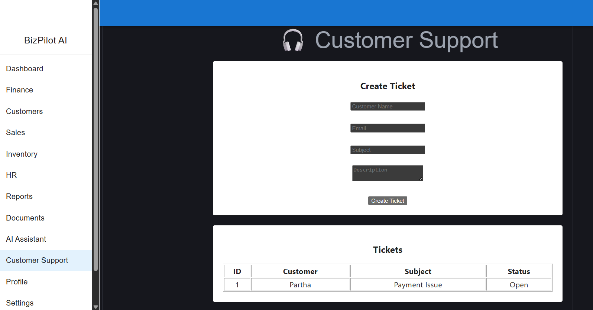
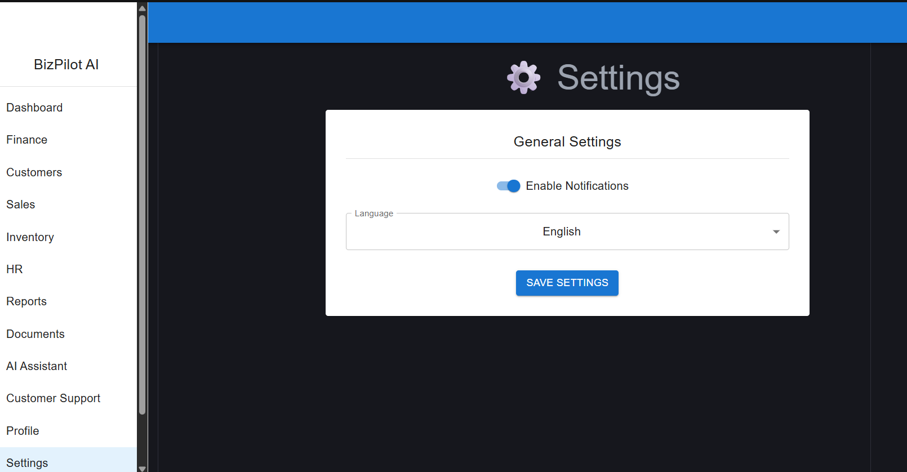
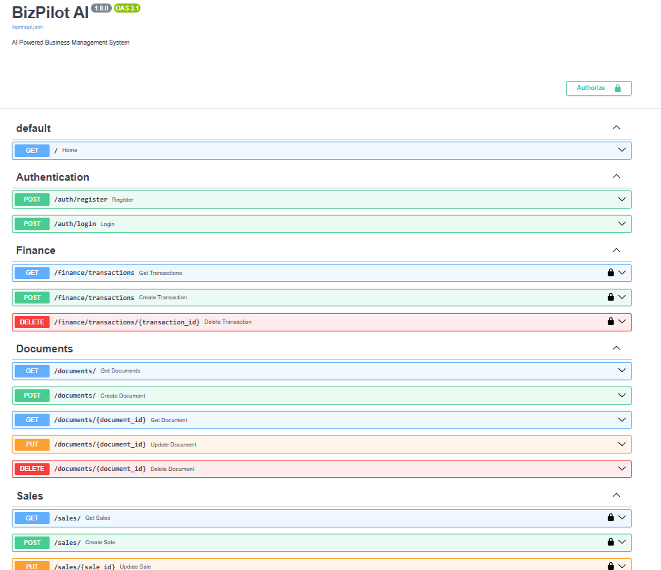

# 🚀 BizPilot AI

An AI-Powered Business Management System built using **React.js**, **FastAPI**, **Python**, **SQLite**, **SQLAlchemy**, **Material UI**, and **JWT Authentication**.

---

# Project Overview

**BizPilot AI** is a modern full-stack business management platform designed to simplify day-to-day business operations through a clean web interface and secure backend.

The application enables businesses to manage finance, customers, sales, inventory, employees, reports, documents, and customer support from a centralized dashboard. It also includes an AI Assistant module to support business decision-making and improve productivity.

---

# Features

* Secure User Registration & Login
* JWT Authentication
* Interactive Business Dashboard
* Finance Management
* Customer Management
* Sales Management
* Inventory Management
* HR Management
* Business Reports
* Document Management
* AI Assistant Module
* Customer Support System
* User Profile Management
* Settings Module
* Responsive User Interface

---

# Technologies Used

## Frontend

* React.js
* Vite
* Material UI
* Axios
* React Router DOM

## Backend

* Python
* FastAPI
* SQLAlchemy
* SQLite
* JWT Authentication
* Pydantic
* Uvicorn

---

# Modules

* Dashboard
* Finance
* Customers
* Sales
* Inventory
* Human Resources (HR)
* Reports
* Documents
* AI Assistant
* Customer Support
* Profile
* Settings

---

# Application Screenshots

## Dashboard

## Finance Module

## Customer Support

## Setting

## Backend API

---

# Project Structure

`	ext
BizPilot-AI/
│
├── frontend/
│   └── React + Vite Application
│
├── backend/
│   ├── app/
│   ├── routes/
│   ├── models/
│   ├── schemas/
│   ├── crud.py
│   ├── database.py
│   └── main.py
│
├── ai_engine/
│
├── database/
│
├── docs/
│   └── screenshots/
│
├── tests/
│
├── requirements.txt
├── README.md
└── .gitignore
`

---

# Installation

## Clone the Repository

`ash
git clone https://github.com/Saarrathy/BizPilot-AI.git
`

## Navigate to the Project Directory

`ash
cd BizPilot-AI
`

## Backend Setup

`ash
cd backend

pip install -r requirements.txt

py -m uvicorn app.main:app --reload
`

Backend runs at:

`	ext
http://127.0.0.1:8000
`

Swagger API:

`	ext
http://127.0.0.1:8000/docs
`

---

## Frontend Setup

`ash
cd frontend

npm install

npm run dev
`

Frontend runs at:

`	ext
http://localhost:5173
`

---

# Future Enhancements

* AI-powered business analytics
* Sales forecasting
* Real-time notifications
* Cloud deployment
* Multi-user role management
* Export reports as PDF & Excel
* Email notifications
* Advanced business insights

---

# Developer

## Saarrathy

**B.Tech – Computer Science & Engineering**

I am passionate about Full-Stack Development, Artificial Intelligence, Machine Learning, Data Analytics, and modern web technologies. I enjoy building practical software solutions that solve real-world business problems through scalable and user-friendly applications.

### Contact

**Email:** saarrathy25@gmail.com

**GitHub:** https://github.com/Saarrathy

---

# Acknowledgements

This project was developed as a personal full-stack learning and portfolio project.

Special thanks to:

* FastAPI
* React.js
* Material UI
* SQLAlchemy
* Vite
* Open Source Community

---

# License

This project is intended for educational and portfolio purposes.

---

# Support

If you found this project useful, please consider giving it a ⭐ on GitHub.

Thank you for visiting this repository.
