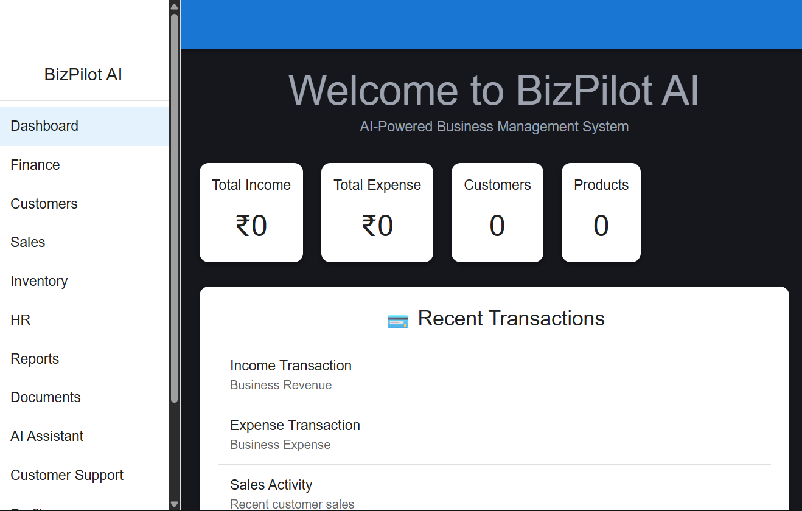
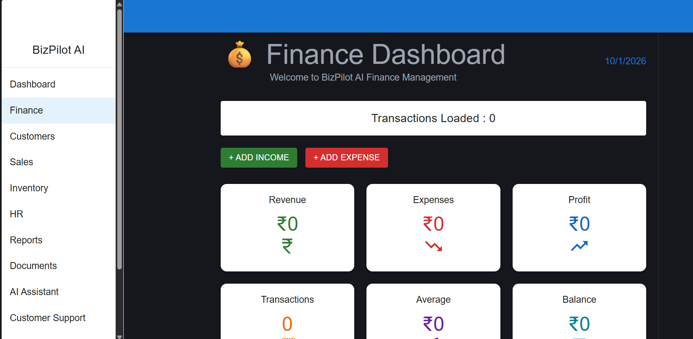

# 🚀 BizPilot AI

AI-Powered Business Management System built with React and FastAPI.

## Features

- JWT Authentication
- Business Dashboard
- Finance Management
- Customer Management
- Sales Management
- Inventory Management
- HR Management
- Reports Module
- Document Management
- AI Assistant
- Customer Support
- Profile Management

## Tech Stack

### Frontend
- React.js
- Vite
- Material UI
- Axios

### Backend
- FastAPI
- Python
- SQLAlchemy
- SQLite

## Run Backend

cd backend

py -m uvicorn app.main:app --reload

## Run Frontend

cd frontend

npm run dev

## Author

Saarrathy
GitHub: https://github.com/Saarrathy

## 📸 Screenshots

### Login Page

### Dashboard

### Finance Module

### Customer Support

### Profile

